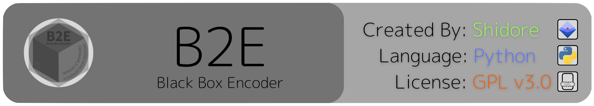

</img>
</img>

## EXPLANATION
### Definition:
> B2E    - B2E stands for Black Box Encoder (B2 means two B`s).

## REQUIREMENTS
### Packages:
> Python [3.10 or higher]

### Storage:
> With Pre-Installed Base Development Environments: Around 80kB [B2E (Around. 25kB)]

> Without Base Development Environments:            Around 90mB [Python-v3 (90mB) / B2E (Around. 20kB)]

## FEATURES
> Efficient & Safe Encoding

> Easy Local Python Imports & Example

> Anti-Reverse Engineering

> Anti-Brute Forcing

## HOW-IT-WORKS
### Issuance of public key:
> The user determines the content of the public key as a password just like: "secret123!", "123456.seven" which is memorable for the user and the others to use the text to decode the text. The public key is capable of any Unicode character. On the other hand, making your key too memorable, makes the key more vulnerable to dictionary-type attacks.

> The public key goes through the "black box" that operates random multiple calculations that would result in equalized as the result of other machines that are calculating.

> The result calculated through the "black box" would be used for the encoding process that would happen later on.

> Content of the black box would be the same for all b2e encoders, so the encoding result would end up the same in any time, place, or device unless the user is not using the same public key.

### The difficulty of brute forcing the public key:
#### Calculating total patterns of encoding valid:

```Alphabet(Low&High Case)[56]+Integers[10]+SpecialCharacters[33]=99``` All Unicode characters are acceptable.

```(Assume that maximum length of public key is 20 letters) 99^1+99^2+99^3+99^4+・・・99^17+99^18+99^19+99^20```
> Resulting in 8,262,529,267,563,862,879,390,884,427,947,885,999,000 total patterns.

#### Calculating ETA to brute force the public key:
```(Assume that answer speed for every public key is 0.00001 seconds and without a quantum computer) 826,252,926,756,386,287,939,088,442,794,788,599,9000*0.00001```

> Resulting in 8.262529267563863*10^34 seconds.

> = Around 2.62003084334216828*10^27 centuries to brute force the public key.

## HOW-TO-USE
> Step 1 - Open terminal

> Step 2 - Type in the following:

```git clone https://github.com/sh1d0re/b2e.git```

```cd b2e ; cp b2e.py``` ``` // Enter The Directory You Want To Import B2E Here [Ex. /projects/b2e_encoder /test/projects/]```

> Step 3 - To use it in your python code locally, import script.py and the b2e class by using the following code on the head of your program:

```from b2e import b2e```

> Step 4 - Using B2E in your python code.
#### The class "b2e" contains 2 definitions of "encode", and "decode". The following code returns the encode or decode result.
```b2e.encode("ENTER PUBLIC KEY HERE", "ENTER ENCODE TEXT HERE")```

```b2e.decode("ENTER PUBLIC KEY HERE", "ENTER DECODE TEXT HERE")```
